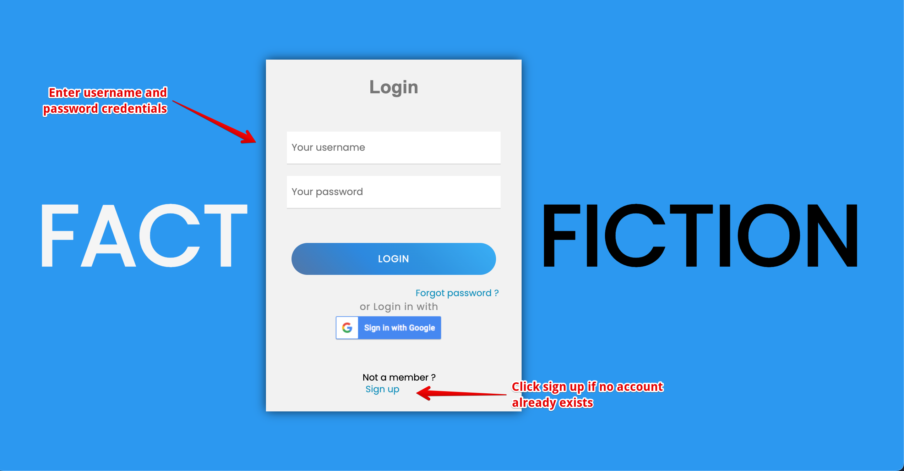
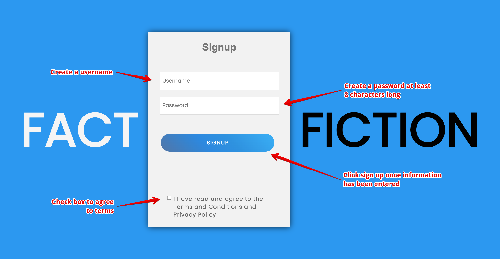
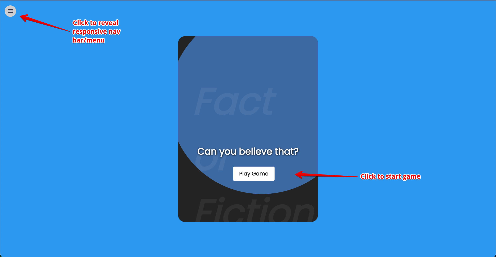
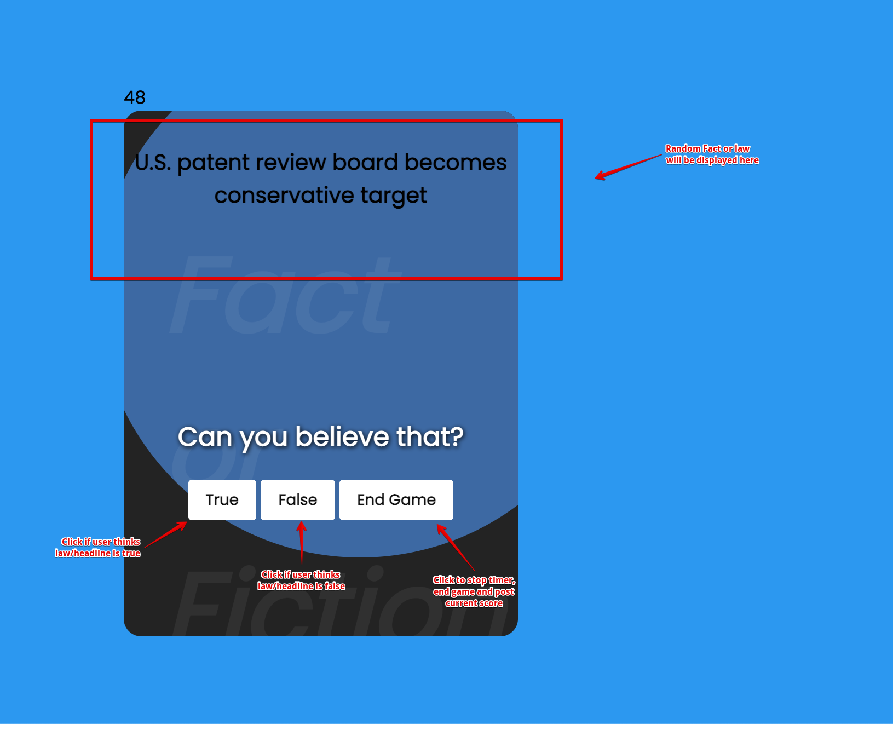
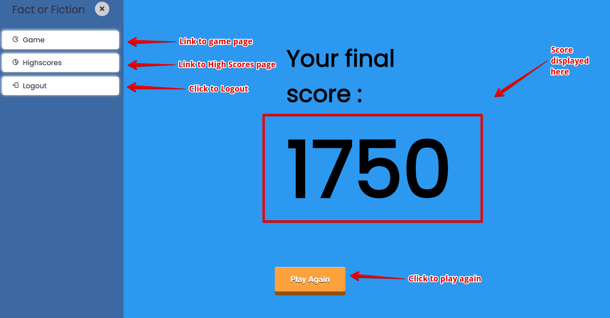
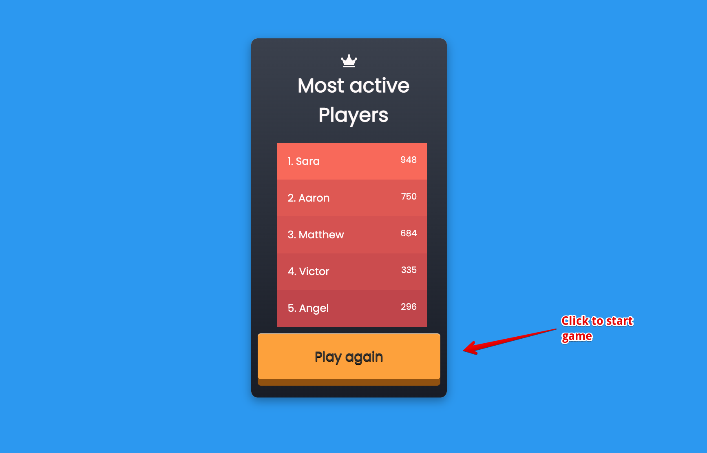
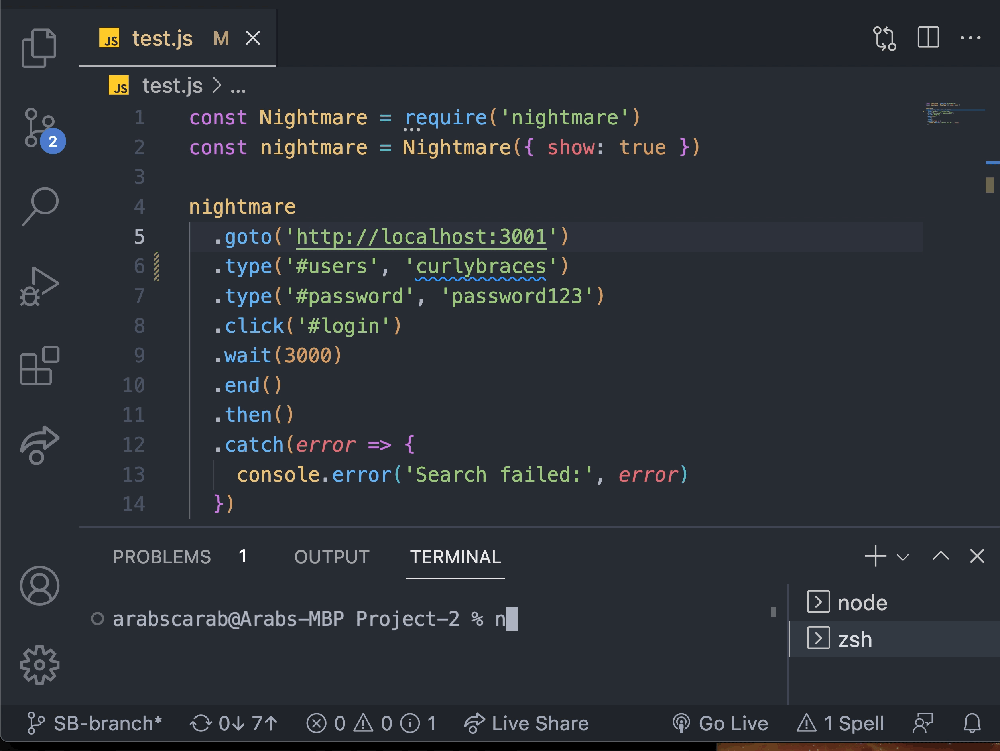

# Fact or Fiction

## Deployed Website
[Deployed Website](https://factorfiction.herokuapp.com/)  
Initial Deployment Date: August 10, 2022

## Description
Fact or fiction is a full-stack application that allows users to play an interactive game, determining whether or not presented laws or headlines are real or fake.

## Table of Contents
- [Installation](#Installation)  
- [Usage](#Usage)
- [Future](#Future)
- [Contributing](#Contributing)
- [Questions](#Questions)

## Installation
- [Node.js](https://nodejs.org/en/)
- [Nightmare](https://www.npmjs.com/package/nightmare)
- [MySQL2](https://www.npmjs.com/package/mysql2)
- [Handlebars.js](https://www.npmjs.com/package/handlebars)
- [dotenv](https://www.npmjs.com/package/dotenv)
- [node.bcrypt.js](https://www.npmjs.com/package/bcrypt)
- [Express](https://www.npmjs.com/package/bcrypt)
- [Express Handlebars](https://www.npmjs.com/package/express-handlebars)
- [node-fetch](https://www.npmjs.com/package/node-fetch)
- [Sequelize](https://www.npmjs.com/package/sequelize)
- [Bootstrap](https://getbootstrap.com/)
- [Kaggle](https://www.kaggle.com/)

## Usage
This full-stack JavaScript program can be enjoyed by anyone who would like to test their skills and determine outrageous laws and/or news headlines as real or fake. If the user would like to run this program locally, the above packages must first be installed.
 
Note: Bootstrap was used for styling and Kaggle was used to get fake new headlines.
  
To access the game, the user will first be directed to the homepage where a user can sign in if they have an existing login.

  
If users do not have a current account, they can click 'Sign Up' and will be asked to enter new account information.

  
Once logged in, the user will be directed to the game page. The navigation menu to the left offers options for the user to logout, view high scores or play the game. To start the game, the user will click 'Play Game' button located on the game card.

  
Once the game starts, the user will have 60 seconds to answer as many prompts correctly as possible. Each correct answer will add 50 points to the final score

  
The game will end once the timer runs out or if the user clicks the 'End Game' button. 

  
Once the game is over, the final score will be presented to the user and they will be given the option to play the game again, view high scores, or logout.

  
As a developer wanting to test functionality and authorization of login credentials, the Nightmare package can be utilized. Simply start your server, enter credentials you would like to test and type 'node test.js'.  

## Future Directions
- Include option to login with Google credentials
- Require email address to sign up
- Add sound while game program is running
- Post top 5 high scores
- Display Username in nav bar when logged in

## Contributing
<!-- Table code borrowed from Andrew Edwards https://github.com/andrew87e-->
<table>
  <tr>
<td align="center"><a href="https://github.com/aanglin"> <b>Aaron Anglin</b></a></td>
<td align="center"><a href="https://github.com/missatrox44"> <b>Sara Baqla</b></a></td>
<td align="center"><a href="https://github.com/Castoreno05"> <b>Matthew Castoreno</b></a></td>
<td align="center"><a href="https://github.com/VictorGutierrez25"> <b>Victor Guiterrez</b></a></td>
<td align="center"><a href="https://github.com/amezabla"> <b>Angel Meza</b></a></td>
 </tr>
</table>

## Questions
Feel free to contact any contributing developer with suggestions for improvements, questions or concerns.
 
[Email: Aaron Anglin](mailto:aaron.anglin101@gmail.com) 
[Email: Sara Baqla](mailto:missatrox44@gmail.com)  
[Email: Matthew Castoreno](mailto:matthew.castoreno@yahoo.com) 
[Email: Victor Guiterrez](mailto:gutriv4@gmail.com) 
[Email: Angel Meza](mailto:mezatx@gmail.com)
